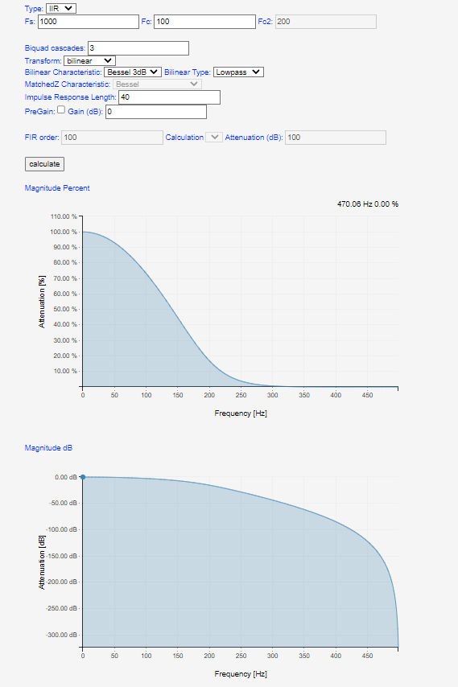
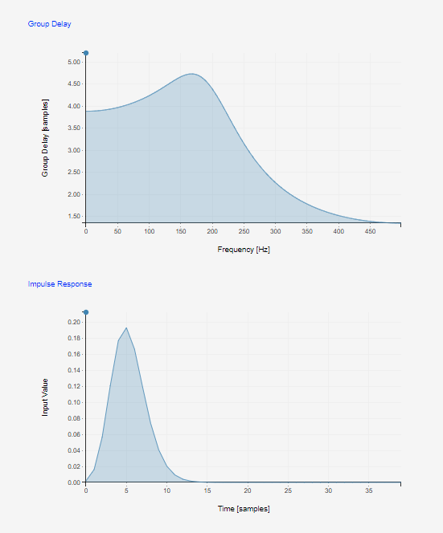
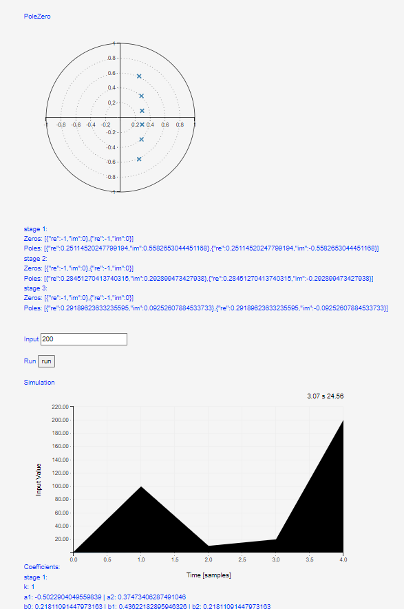

## Procedure

1. Click on the Experiment tab SIMULATOR will open the workspace
                              
2. Read the instruction to understand how the simulation to be executed.

3. Select IIR from Type and select Calculation as Bandpass  
Magnitude Percent and Magnitude dB  
  

4. Select the sampling frequency (Fs) and centre frequency (Fc) of the input signal.
                            
5. Put the value of FIR filter order from FIR order tab,select filter type from Calculation sinc lowpass or sinc highpass and attenuation(dB)          
                            
6. Click on the "Calculate" buttton to observe the Magnitude,Group delay,Impulse Response and simulation on plot                  
                        
7. Note:                       
- Make sure if selection of tranform in case of bilinear, matchedZ Characteristic disable or vice-versa  
- Make sure if selection of tranform matchedZ pregain Gain disable  
  
PoleZero and No poles/zeroes for FIR filters  
  
