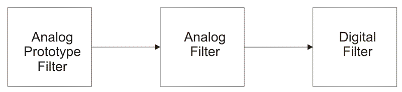
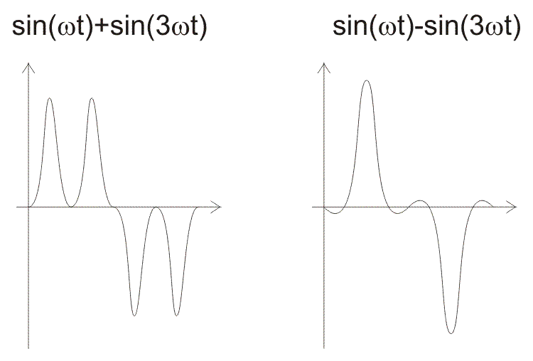
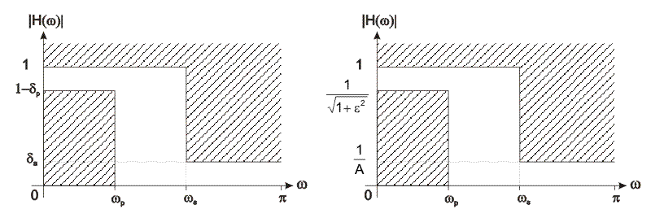
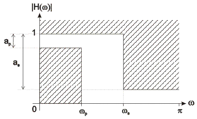
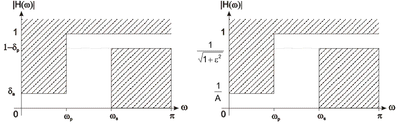

## Theory

                            
                            
Finite Impulse Response (FIR) Filter

                            
IIR filters are digital filters with infinite impulse response. Unlike FIR filters, they have the feedback 
                                (a recursive part of a filter) and are known as recursive digital filters therefore. Block diagrams of FIR and IIR 
                                filters 

                            
For this reason IIR filters have much better frequency response than FIR filters of the same order. Unlike FIR filters, 
                                their phase characteristic is not linear which can cause a problem to the systems which need phase linearity. For this 
                                reason, it is not preferable to use IIR filters in digital signal processing when the phase is of the essence.
                            
Otherwise, when the linear phase characteristic is not important, the use of IIR filters is an excellent solution.

                            
There is one problem known as a potential instability that is typical of IIR filters only. FIR filters do not have such 
                                a problem as they do not have the feedback. For this reason, it is always necessary to check after the design process 
                                whether the resulting IIR filter is stable or not.

                            
IIR filters can be designed using different methods. One of the most commonly used is via the reference analog prototype
                                filter. This method is the best for designing all standard types of filters such as low-pass, high-pass, band-pass and 
                                band-stop filters.

                            
Figure 10.1 illustrates the block diagram of this method.

                               
 
                                Fig-10.1 

                            
FIR filters can have linear phase characteristic, which is not typical of IIR filters. When it is necessary to have linear
                                phase characteristic,

                            
FIR filters are the only available solution. In other cases when linear phase characteristic is not necessary, such as 
                                speech signal processing,

                            
FIR filters are not good solution. IIR filters should be used instead. The resulting filter order is considerably lower 
                                for the same frequency response. 

                            
The filter order determines the number of filter delay lines, i.e. number of input and output samples that should be saved 
                                in order that the next output sample can be computed. For instance, if the filter order is 10, it means that it is 
                                necessary to save 10 input samples plus 10 output samples preceeding the current sample. All these 21 samples will 
                                affect the next output sample.

                            
The IIR filter transfer function is a ratio of two polynomials of complex variable z-1. The numerator defines location 
                                of zeros, whereas the denominator defines location of poles of the resulting IIR filter transfer function.

                            
Figure 10.2. illustrates input and output signals of the system with non-linear phase characteristic.

                              
 
                                Fig-10.2 

                            
The system introduces phase shift of 0 radians at frequency of &omega; and &Pi; radians
                                at three times higher frequency. 
                                Input signal consists of nature frequency &omega; and harmonics with the same amplitude at three times higher frequency. 
                                Figure on the left illustrates an input signal, whereas Figure on the right illustrates an output signal. As seen, 
                                these two signals have different waveforms. Neither the power of the signal nor amplitudes of particular harmonics 
                                have been changed, but the phase of the second harmonic.

                            
Assume that an input represents a speech signal where the phase is not important. In this case such phase distorsion 
                                would be negligable as the system satisfies the stated requirements. Otherwise, if the phase is important, such a huge 
                                distorsion mustn’t be allowed.

                            
Infinite impulse response (IIR) filter design

                            
The most commonly used IIR filter design method uses reference analog prototype filter. It is the best method to use when 
                                designing standard filters such as low-pass, high-pass, bandpass and band-stop filters

                            
The filter design process starts with specifications and requirements of the desirable IIR filter. A type of reference 
                                analog prototype filter to be used is specified according to the specifications and after that everything is ready for 
                                analog prototype filter design.

                            
The next step in the design process is scaling of the frequency range of analog prototype filter into desirable frequency 
                                range. This is how an analog prototype filter is converted into an analog filter.

                            
After the analog filter is designed, it is time to go through the last step in the digital IIR filter design process. 
                                It is conversion from analog to digital filter. The most popular and most commonly used converting method is bilinear 
                                transformation method. The resulting filter, obtained in this way, is always stable. However, instability of the resulting
                                filter, when bilinear transformation is used, may be caused only by the finite word-length side-effect. 

                            
Basic concepts and IIR filter specification 

                            
First of all, it is necessay to learn the basic concepts that will be used further in this book.
                                You should be aware that 
                                without being familiar with these concepts, it is not possible to understand analyses and synthesis of digital filters.

                            
Figure 10.3 illustrates a low-pass digital filter specification. The word specification refers to the frequency response
                                specification.

                            
 
                                H(&omega;) 

                            
 
                                Figure 10.3: Lowpass digital filter specification 

                            
where

                            

 &omega;p  normalized passband cut-off frequency

                            

 &omega;s  normalized stopband cut-off frequency

                            

 &delta;1  maximum passband ripples

                            

&delta;2 minimum stopband attentuation

                            

&epsilon; passband attenuation parameter

                            

A stopband attenuation parameter

                            

ap  maximum passband ripples [dB]

                            

as minimum stopband attenuation [dB]

                            
`delta_p=1-10^(-a_p/10)`
 
                            
`=1-(1/sqrt(1+epsilon^2))`

                            
`epsilon=sqrt(delta_p(2-delta_p))/(1-delta_p)=sqrt(10^(a/p)-1)`

                            
`a_p=-20log(1-delta_p)=10log(1+epsilon^2)`

                            
Frequency normalization can be expressed as follows:

                            
`omega=(2pif/f_s)`

                            
where:

                            
fs is the sampling frequency

                            
f is the frequency to normalize and

                            
&omega; is the normalized frequency.

                            
Specifications for high-pass filter is defined almost the same way as those for low-pass filters.

                            
Figure 10.4 illustrates a highpass filter specification.

                            
 
                               Figure 10.4: Highpass digital filter specification 

                        
/

     
 